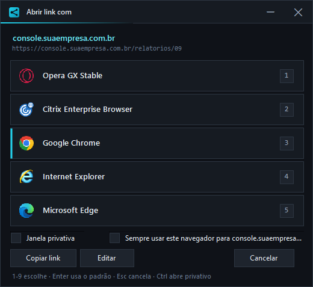
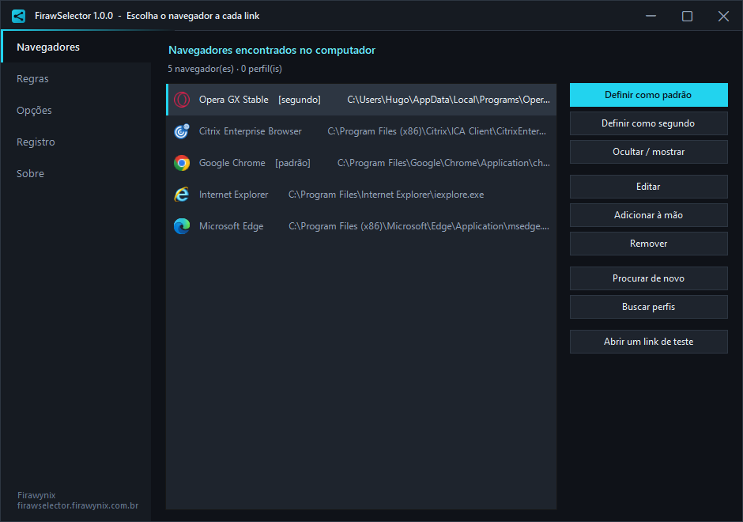
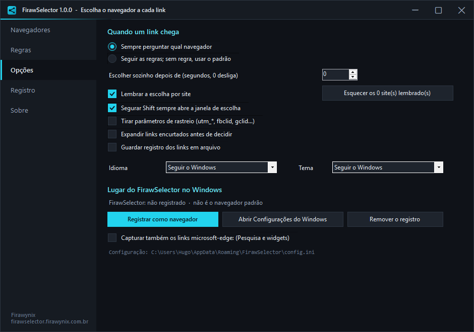

# FirawSelector

Cada link abre no navegador **certo** — por regra, ou perguntando na hora.

O FirawSelector se registra como navegador do Windows. Quando qualquer programa abre um link (Outlook, Teams, Slack, WhatsApp, um `.html` clicado, a Pesquisa do Windows), ele intercepta e decide:

- **casou com uma regra** → vai direto para o navegador daquela regra, sem janela nenhuma
- **nenhuma regra casou** → abre a janela de escolha, com os navegadores instalados



## Por que isso existe

O Windows só aceita **um** navegador padrão. Mas o dia a dia não é assim:

- o sistema interno da empresa só funciona no Edge
- a conta do cliente está no perfil "Trabalho" do Chrome, e a sua no "Pessoal"
- link de rede social você prefere abrir em janela privativa
- e o `microsoft-edge:` da Pesquisa do Windows ignora o navegador padrão de propósito

## O que ele faz

| Recurso | Detalhe |
|---|---|
| **Registro como navegador** | Entra na lista de Aplicativos padrão do Windows (`http`, `https`, `ftp`, `.htm`, `.html`, `.xhtml`) |
| **Regras por domínio** | `intranet.local`, `*.google.com` — a primeira que casar vence |
| **Regras por endereço** | `https://*/docs/*` com curingas `*` e `?` |
| **Regras por expressão** | Regex ECMAScript no endereço inteiro, quando o curinga não basta |
| **Janela de escolha** | Ícone real de cada navegador, atalho `1`-`9`, `Enter` para o padrão, `Esc` cancela |
| **Modo enxuto** | Só ícone (grande), nome e número — sem endereço, sem caixas, sem botões |
| **Ícone por navegador** | Troque por um `.ico`, ou pelo ícone nº _n_ de dentro de um `.exe`/`.dll` |
| **Ordem da lista** | Subir/Descer: quem está em primeiro é o `1` na janela de escolha |
| **Importar / exportar** | Leva a configuração inteira para outra máquina em um `.ini` |
| **Perfis** | Chrome, Edge, Brave e Vivaldi (`--profile-directory`) e Firefox (`-P`) viram entradas próprias |
| **Janela privativa** | Por regra, por marcação na hora, ou segurando `Ctrl` no clique |
| **Lembrar por site** | "Sempre usar este navegador para `dominio.com`" — e dá para esquecer tudo depois |
| **Escolha automática** | Conta regressiva opcional; qualquer tecla ou movimento do mouse cancela |
| **Segurar Shift** | Força a janela de escolha mesmo quando existe regra |
| **Limpar rastreio** | Remove `utm_*`, `fbclid`, `gclid`, `msclkid` e cia. antes de abrir |
| **Expandir encurtados** | Segue o redirecionamento (HEAD, 5 saltos, 2,5 s) e decide pelo destino real |
| **Capturar `microsoft-edge:`** | Assume o protocolo que a Pesquisa e os widgets usam para furar o padrão |
| **Editar / copiar o link** | Antes de abrir, na própria janela de escolha |
| **Registro em arquivo** | Endereço, navegador e o **motivo** da decisão |
| **Português e inglês** | Troca na hora, ou segue o Windows |
| **Tema ciano** | Escuro, claro ou seguindo o Windows — com barra de título própria |

## Baixar

| Arquivo | Para quê |
|---|---|
| **FirawSelector-Setup.exe** | **Comece por aqui.** Instala, cria atalhos, registra a desinstalação e (opcional) já registra como navegador |
| FirawSelector-Studio.exe | Só o configurador, sem instalar |
| FirawSelector.exe | Só o motor — é ele que o Windows chama com o link |

Sem assinatura de código: o SmartScreen avisa na primeira vez. **Mais informações › Executar assim mesmo**.

## Requisitos

- Windows 10 ou 11 (funciona no 8.1; abaixo do build 17763 cai no tema claro do shell)
- .NET Framework 4.x — já vem no Windows 10 1903+ e no 11
- 32 ou 64 bits: os binários são **AnyCPU**, o mesmo arquivo serve nos dois

Não precisa de administrador. Instala em `%LOCALAPPDATA%\FirawSelector`.

## Como usar

1. rode o **FirawSelector-Setup.exe** e deixe marcado *Registrar como navegador do Windows*
2. o Windows abre **Configurações › Aplicativos › Aplicativos padrão** — escolha o **FirawSelector** para `http`, `https` e `.html`
3. abra o **FirawSelector Studio**: a aba **Navegadores** já lista o que existe na máquina
4. marque um como **padrão** (é o do `Enter` e o da escolha automática)
5. na aba **Regras**, crie o que for direto: `*.suaempresa.com.br` → Edge, `*.google.com` → Chrome Trabalho
6. teste sem abrir nada: campo **Testar um endereço** mostra quem venceria e por quê

O passo 2 é manual porque a Microsoft não deixa nenhum programa se tornar padrão sozinho — só a tela de Configurações define isso.





Passo a passo interativo, sem instalar nada: **[firawselector.firawynix.com.br](https://firawselector.firawynix.com.br)**.

## Linha de comando

```
FirawSelector.exe <url> [<url>...]   decide e abre (é o que o Windows chama)
FirawSelector.exe --register         registra como navegador e abre as Configurações
FirawSelector.exe --register --silent  registra sem abrir nada (implantação)
FirawSelector.exe --unregister       tira o registro
FirawSelector.exe --capture-edge     assume o protocolo microsoft-edge:
FirawSelector.exe --release-edge     devolve o protocolo
FirawSelector.exe --settings         abre o Studio
```

Vários endereços de uma vez: o primeiro pergunta, os outros seguem a mesma escolha.

## Configuração

Um arquivo INI, editável à mão:

```
%APPDATA%\FirawSelector\config.ini
```

**Modo portátil**: se existir um `config.ini` na mesma pasta do `.exe`, é ele que vale — o programa roda de um pendrive sem tocar no perfil da máquina.

```ini
[geral]
modo=regras            ; regras | perguntar
padrao=chrome
tempo=5                ; escolhe sozinho depois de 5 s (0 desliga)
limparRastreio=1

[navegadores]
0001=chrome|Google Chrome|C:\...\chrome.exe|||chromium|0|0

[regras]
0001=*.suaempresa.com.br|msedge|host|0|1
0002=https://*/admin/*|firefox|url|1|1

[lembrados]
github.com=firefox
```

A numeração (`0001`, `0002`) é a ordem de avaliação: a primeira regra que casar vence.

## Compilar

Não precisa de Visual Studio nem de SDK — o compilador C# já vem no Windows:

```
build.cmd
```

Gera `FirawSelector.exe`, `FirawSelector Studio.exe` e `FirawSelector Setup.exe`, e copia os três para `dist\`. O ícone (`firawselector.ico`) é gerado por `tools\mkico.cs` na primeira compilação.

Arquivos:

| Arquivo | O que é |
|---|---|
| `Core.cs` | Ambiente, paleta ciano e as duas tabelas de idioma |
| `Modelo.cs` | Navegador, Regra, INI, motor de decisão e registro no Windows |
| `Janela.cs` | Barra de título própria e os controles no tema |
| `FirawSelector.cs` | O motor e a janela de escolha |
| `FirawSelectorStudio.cs` | O configurador |
| `FirawSelectorSetup.cs` | O instalador (carrega os outros dois dentro) |

## Desinstalar

Configurações › Aplicativos › **FirawSelector** › Desinstalar. Ele tira o registro de navegador **antes** de apagar os arquivos — sem isso o Windows continuaria mandando links para um programa que não existe mais. As regras e o `config.ini` ficam em `%APPDATA%\FirawSelector`.

---

Firawynix · [firawselector.firawynix.com.br](https://firawselector.firawynix.com.br)
